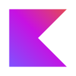

<h3>👋 Hello, I'm Ppc · <a href="https://www.lxpavilion.top/">lxpavilion</a></h3>

- Full-stack Web Developer
- Java Microservices Engineer
- AI/RAG Tinkerer (for fun, mostly)

> Code, science, and thoughts — what I spend my days on.

---

#### 🧩 Personal Works

- [**dsh-pet**](https://github.com/PC2005-cloud/dsh-pet) `TypeScript` — DSH 桌面宠物：一行命令装好即用的透明动画桌宠，支持多开与 DIY 素材链
- [**lxpavilion**](https://github.com/pc-Blog/lxpavilion) `Next.js` `Spring Boot` `Cloudflare` — 栏轩阁 · 全栈个人博客与作品集

#### 🚀 Real-World Projects

- [**medrec-sys**](https://github.com/medrec-sys) `Spring AI` `Qdrant` `Redis` `MyBatis-Plus` — 医疗记录 RAG 智能问答系统，双向量库 + PDFBox 文档解析
- [**smart-mall**](https://github.com/smart-mall) `Spring Cloud Alibaba` `Vue 3` — 自建 B2C 商城微服务系统

---

#### 🛠️ Tech Stack

##### Fullstack

<picture>
  <source media="(prefers-color-scheme: dark)" srcset="assets/stats/stats-dark.svg" />
  <source media="(prefers-color-scheme: light)" srcset="assets/stats/stats-light.svg" />
  
</picture>

<code></code>
<code></code>
<code></code>
<code></code>
<code></code>
<code></code>
<code></code>
<code></code>
<code></code>
<code></code>

##### Infra

<code></code>
<code></code>
<code></code>
<code></code>
<code></code>
<code></code>
<code></code>
<code></code>
<code></code>
<code></code>

##### Other

<code></code>
<code></code>
<code></code>
<code></code>
<code></code>
<code></code>

---

  <picture>
    <source media="(prefers-color-scheme: dark)" srcset="assets/snake/snake-dark.svg" />
    <source media="(prefers-color-scheme: light)" srcset="assets/snake/snake.svg" />
    
  </picture>

